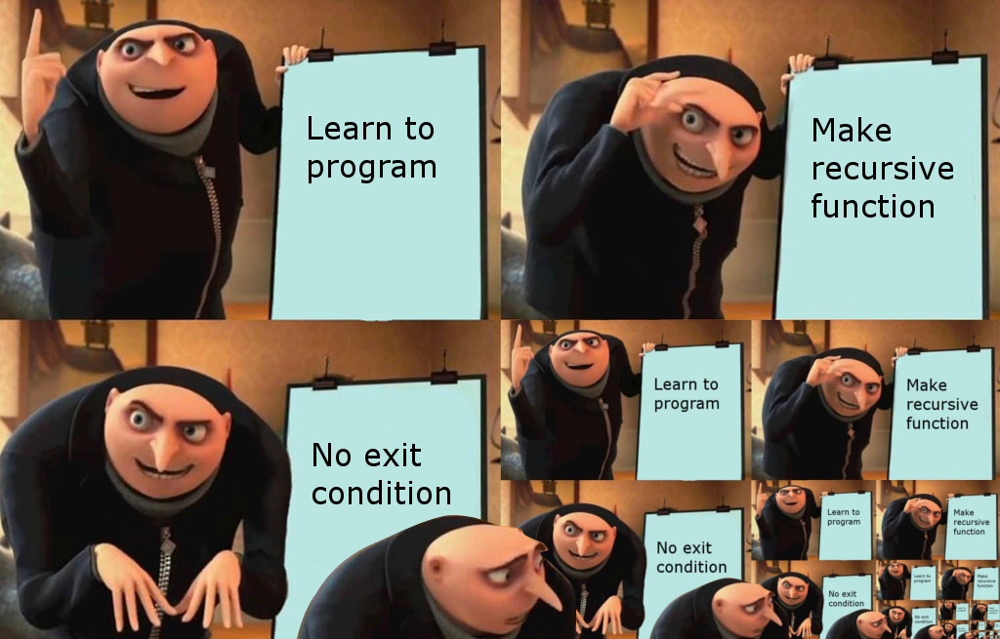

# Mergesort and QuickSort

Both algorithms are based on recursion and divide-and-conquer strategy. Both are efficient for large datasets, but they have different performance characteristics.

## Recursion



Recursion is a programming technique where a function calls itself. It is a powerful tool to solve problems that can be divided into smaller problems of the same type.

The recursion has two main parts:

- Base case: the condition that stops the recursion;
- Recursive case: the condition that calls the function again.

Let's see an example of a recursive function to calculate the factorial of a number:

```c++
#include <iostream>

int factorial(int n) {
  if (n == 0) {
    return 1;
  }
  return n * factorial(n - 1);
}
```

## Mergesort

Mergesort divides the input array into two halves, calls itself for the two halves, and then merges the two sorted halves.

You can split the algorithm into two main parts:

- Mergesort: the function that calls itself for the two halves;
- Merge: the function that merges the two sorted halves.

You can implement Mergesort in two ways:

- Recursive: the function calls itself for the two halves;
- Iterative: the function uses a loop to merge the two sorted halves.

The interactive version is more efficient than the recursive version, but it is more complex to understand. But both uses the same core algorithm to merge the two sorted halves.

```c++
#include <iostream>
#include <vector>
#include <queue>

template <typename T>
requires std::is_arithmetic<T>::value // C++20
void merge(std::vector<T>& arr, const size_t start, const size_t mid,  const size_t end) {
    // create a temporary array to store the merged array
    std::vector<T> temp(end - start + 1);

    // indexes for the subarrays:
    const size_t leftStart = start;
    const size_t leftEnd = mid;
    const size_t rightStart = mid + 1;
    const size_t rightEnd = end;

    // indexes for the temporary array:
    size_t tempIdx = 0;
    size_t leftIdx = leftStart;
    size_t rightIdx = rightStart;

    // merge the subarrays
    while (leftIdx <= leftEnd && rightIdx <= rightEnd) {
        if (arr[leftIdx] < arr[rightIdx])
            temp[tempIdx++] = arr[leftIdx++];
        else
            temp[tempIdx++] = arr[rightIdx++];
    }

    // copy the remaining elements of the left subarray
    while (leftIdx <= leftEnd)
        temp[tempIdx++] = arr[leftIdx++];

    // copy the remaining elements of the right subarray
    while (rightIdx <= rightEnd)
        temp[tempIdx++] = arr[rightIdx++];

    // copy the merged array back to the original array
    std::copy(temp.begin(), temp.end(), arr.begin() + start);
}

template <typename T>
requires std::is_arithmetic<T>::value // C++20
void mergesortRecursive(std::vector<T>& arr,
               size_t left,
               size_t right) {
    if (right - left > 0) {
        size_t mid = (left + right) / 2;
        mergesortRecursive(arr, left, mid);
        mergesortRecursive(arr, mid+1, right);
        merge(arr, left, mid, right);
    }
}

template <typename T>
requires std::is_arithmetic<T>::value // C++20
void mergesortInteractive(std::vector<T>& arr) {
    for(size_t width = 1; width < arr.size(); width *= 2) {
        for(size_t left = 0; left < arr.size(); left += 2 * width) {
            size_t mid = std::min(left + width, arr.size());
            size_t right = std::min(left + 2 * width, arr.size());
            merge(arr, left, mid - 1, right - 1);
        }
    }
}


int main() {
    std::vector<int> arr1;
    for(int i = 1000; i > 0; i--)
        arr1.push_back(rand()%1000);
    std::vector<int> arr2 = arr1;
    
    for(auto i: arr1) std::cout << i << " ";

    mergesortRecursive(arr1, 0, arr1.size() - 1);
    for(auto i: arr1) std::cout << i << " ";
    std::cout << std::endl;

    mergesortInteractive(arr2);
    for(auto i: arr2) std::cout << i << " ";
    std::cout << std::endl;

    return 0;
}
```

The main issue with Mergesort is that it requires extra space O(n) to merge the subarrays. This can be a problem for large datasets. But it is stable and has a time complexity of O(n log n) guaranteed.


