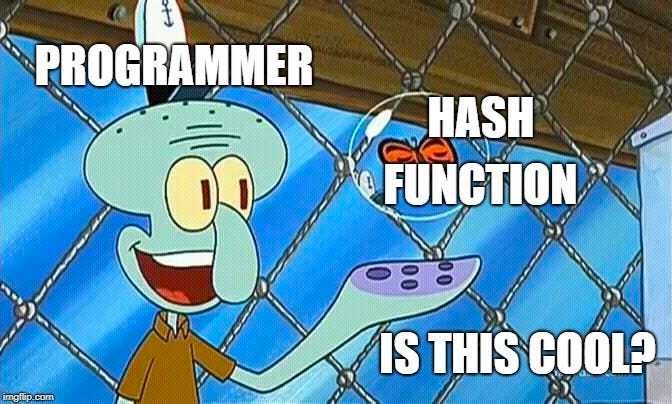
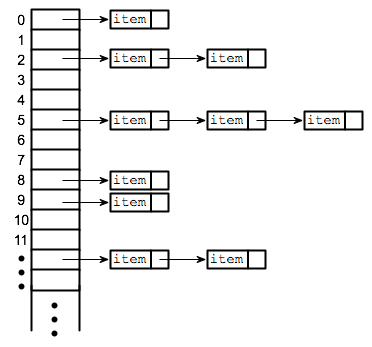
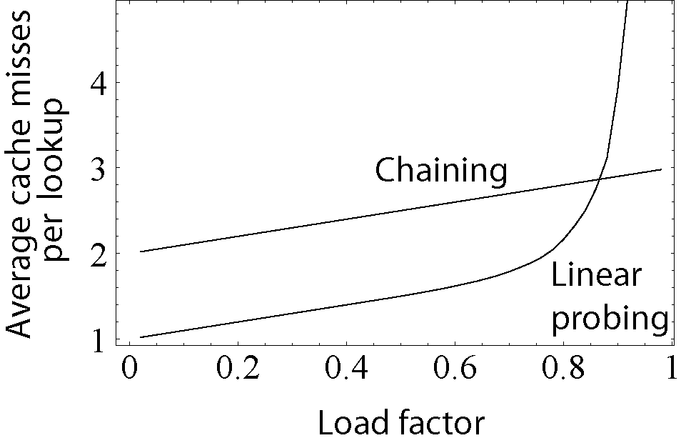

# Hastables


Hashtables ane associative datastructures that stores key-value pairs. It uses a hash function to compute an index into an array of buckets or slots, from which the desired value can be found.

The core of the generic associative container is to implement ways to get and set values by keys such as:

- `void insert(K key, V value)`: Add a new key-value pair to the hashtable. If the key already exists, update the value.
- `V at(K key)`: Get the value of a given key. If the key does not exist, return a default value.
- `void remove(K key)`: Remove a key-value pair from the hashtable.
- `bool contains(K key)`: Check if a key exists in the hashtable.
- `int size()`: Get the number of key-value pairs in the hashtable.
- `bool isEmpty()`: Check if the hashtable is empty.
- `void clear()`: Remove all key-value pairs from the hashtable.
- `V& operator[](K key)`: Get the value of a given key. If the key does not exist, insert a new key-value pair with a default value.

## Key-value pairs

In C++ you could use `std::pair` from the `utility` library to store key-value pairs. 

```c++
#include <utility>
#include <iostream>

int main() {
  std::pair<int, int> pair = std::make_pair(1, 2);
  std::cout << pair.first << " " << pair.second << std::endl;
  // prints 1 2
  return 0;
}
```

Or you could create your own key-value pair class.

```c++
#include <iostream>

template <typename K, typename V>
struct KeyValuePair {
  K key;
  V value;
  KeyValuePair(K key, V value) : key(key), value(value) {}
};

int main() {
  KeyValuePair<int, int> pair(1, 2);
  std::cout << pair.key << " " << pair.value << std::endl;
  // prints 1 2
  return 0;
}
```

## Hash function



The hash function will process the key data and return an index. Usually in C++, the index is of type `size_t` which is biggest unsigned integer the platform can handle.

The hash function should be fast and should distribute the keys uniformly across the array of buckets. The hash function should be deterministic, meaning that the same key should always produce the same hash.

If the size of your key is less than the `size_t` you could just use the key casted to `size_t` as the hash function. If it is not, you will have to implement your own hash function. You probably should use bitwise operations to do so.

```c++
struct MyCustomDataWith128Bits {
  uint32_t a;
  uint32_t b;
  uint32_t c;
  uint32_t d;
  size_t hash() const {
    return (a << 32) ^ (b << 24) ^ (c << 16) ^ d;
  }
};
```

Think a bit and try to come up with a nice answer: what is the ideal hash function for a given type? What are the requirements for a good hash function?

### Special case: String or arrays 

In order to use strings as keys, you will have to create a way to convert the string's underlying data structure into a `size_t`. You could use the `std::hash` function from the `functional` library. Or create your own hash function.

```c++  
#include <iostream>
#include <functional>

size_t hash(const std::string& key) {
  size_t hash=0; // accumulator pattern
  // the cost of this operation is O(n)
  for (char c : key)
    hash = (hash << 5) ^ c;
  return hash;
}

int main() {
  std::hash<std::string> hash;
  std::string key = "hello";
  std::cout << hash(key) << std::endl;
  // prints number
  return 0;
}
```

You can hide and amortize the cost of the hash function by cashing it. There are plenty of ideas for that. Try to come up with your own.

## Hash tables

Now that you have the hash function for you type and the key-value data structure, you can implement the hash table.

There are plenty of algorithms to do so, and even the `std::unordered_map` is not the best, please watch those videos to understand the trade-offs and the best way to implement a hash table.

- [CppCon 2017: Matt Kulukundis “Designing a Fast, Efficient, Cache-friendly Hash Table, Step by Step”](https://www.youtube.com/watch?v=ncHmEUmJZf4&t=2768s)

For the sake of simplicity I will use the operator modulo to convert the hash into an index array. This is not the best way to do so, but it is the easiest way to implement a hash table.

## Collision resolution

### Linked lists


Assuming that your hash function is not perfect, you will have to deal with collisions. Two or more different keys could produce the same hash. There are plenty of ways to deal with that, but the easiest way is to use a linked list to store the key-value pairs that have the same hash.

Try to come up with your own strategy to deal with collisions.


[source](https://www.hackerearth.com/practice/data-structures/hash-tables/basics-of-hash-tables/tutorial/)

#### Key restrictions

In order for the hash table to work, the key should be:

- not modifiable
- implement a hash function
- implement the `==` operator

In C++20 you can use the `concept` feature to enforce those restrictions.

```c++
// concept for a hash table
template <typename T>
concept HasHashFunction =
requires(T t, T u) {
  { t.hash() } -> std::convertible_to<std::size_t>;
  { t == u } -> std::convertible_to<bool>;
  std::is_const_v<T>;
} || requires(T t, T u) {
  { std::hash<T>{}(t) } -> std::convertible_to<std::size_t>;
  { t == u } -> std::convertible_to<bool>;
};


int main() {
  struct MyHashableType {
    int value;
    size_t hash() const {
      return value;
    }
    bool operator==(const MyHashableType& other) const {
      return value == other.value;
    }
  };
  static_assert(HasHashFunction<const MyHashableType>);
  static_assert(HasHashFunction<int>);
  return 0;
}
```

But you can require more from the key if you are going to implement a more complex collision resolution strategy.

#### Hash table implementation with linked lists (chaining) 


This implementation is naive and not efficient. It is just to give you an idea of how to implement a hash table.

```c++
#include <iostream>

// key should not be modifiable
// implements hash function and implements == operator
template <typename T>
concept HasHashFunction =
requires(T t, T u) {
  { t.hash() } -> std::convertible_to<std::size_t>;
  { t == u } -> std::convertible_to<bool>;
  std::is_const_v<T>;
} || requires(T t, T u) {
  { std::hash<T>{}(t) } -> std::convertible_to<std::size_t>;
  { t == u } -> std::convertible_to<bool>;
};

// hash table
template <HasHashFunction K, typename V>
struct Hashtable {
private:
    // key pair
    struct KeyValuePair {
        K key;
        V value;
        KeyValuePair(K key, V value) : key(key), value(value) {}
    };

    // node of the linked list
    struct HashtableNode {
        KeyValuePair data;
        HashtableNode* next;
        HashtableNode(K key, V value) : data(key, value), next(nullptr) {}
    };

    // array of linked lists
    HashtableNode** table;
    int size;
public:
    // the hashtable will start with a constant size. You can resize it if you want or use any other strategy
    // a good size is something similar to the number of elements you are going to store
    explicit Hashtable(size_t size) {
        // you colud make it automatically resize and increase the complexity of the implementation 
        // for the sake of simplicity I will not do that
        this->size = size;
        table = new HashtableNode*[size];
        for (size_t i = 0; i < size; i++) {
            table[i] = nullptr;
        }
    }
private:
    inline size_t convertKeyToIndex(K t) {
            return t.hash() % size;
    }
public:
    // inserts a new key value pair
    void insert(K key, V value) {
        // you can optionally resize the table and rearrange the elements if the table is too full
        size_t index = convertKeyToIndex(key);
        auto* node = new HashtableNode(key, value);
        if (table[index] == nullptr) {
            table[index] = node;
        } else {
            HashtableNode* current = table[index];
            while (current->next != nullptr)
                current = current->next;
            current->next = node;
        }
    }

    // contains the key
    bool contains(K key) {
        size_t index = convertKeyToIndex(key);
        HashtableNode* current = table[index];
        while (current != nullptr) {
            if (current->data.key == key) {
                return true;
            }
            current = current->next;
        }
        return false;
    }

    // subscript operator
    // creates a new element if the key does not exist
    // fails if the key is not found
    V& operator[](K key) {
        size_t index = convertKeyToIndex(key);
        HashtableNode* current = table[index];
        while (current != nullptr) {
            if (current->data.key == key) {
                return current->data.value;
            }
            current = current->next;
        }
        throw std::out_of_range("Key not found");
    }

    // deletes the key
    // fails if the key is not found
    void remove(K key) {
        size_t index = convertKeyToIndex(key);
        HashtableNode* current = table[index];
        HashtableNode* previous = nullptr;
        while (current != nullptr) {
            if (current->data.key == key) {
                if (previous == nullptr) {
                    table[index] = current->next;
                } else {
                    previous->next = current->next;
                }
                delete current;
                return;
            }
            previous = current;
            current = current->next;
        }
        throw std::out_of_range("Key not found");
    }

    ~Hashtable() {
        for (size_t i = 0; i < size; i++) {
            HashtableNode* current = table[i];
            while (current != nullptr) {
                HashtableNode* next = current->next;
                delete current;
                current = next;
            }
        }
    }
};

struct MyHashableType {
    int value;
    size_t hash() const {
        return value;
    }
    bool operator==(const MyHashableType& other) const {
        return value == other.value;
    }
};

int main() {
    // keys shouldn't be modifiable, implement hash function and == operator
    Hashtable<const MyHashableType, int> hashtable(5);
    hashtable.insert(MyHashableType{1}, 1);
    hashtable.insert(MyHashableType{2}, 2);
    hashtable.insert(MyHashableType{3}, 3);
    hashtable.insert(MyHashableType{6}, 6); // should add to the same index as 1

    std::cout << hashtable[MyHashableType{1}] << std::endl;
    std::cout << hashtable[MyHashableType{2}] << std::endl;
    std::cout << hashtable[MyHashableType{3}] << std::endl;
    std::cout << hashtable[MyHashableType{6}] << std::endl;
    return 0;
}
```

### Open addressing with linear probing

Open addressing is a method of collision resolution in hash tables. In this approach, each cell is not a pointer to the linked list of contents of that bucket, but instead contains a single key-value pair. In linear probing, when a collision occurs, the next cell is checked. If it is occupied, the next cell is checked, and so on, until an empty cell is found.

The main advantage of open addressing is cache-friendliness. The main disadvantage is that it is more complex to implement, and it is not as efficient as linked lists when the table is too full. That's why we have to resize the table earlier, usually at 50% full, but at least 70% full.

 [source](https://en.wikipedia.org/wiki/File:Hash_table_average_insertion_time.png)

In this implementation below, I have implemented a strategy to resize the table when it is half full. This is a common strategy to mitigate the O(n) search time when we have a lot of collisions. But on each resize, we have to rehash all elements: O(n) when it grows. This growth will occur rarely so this O(n) is amortized.

#### Implementation with open addressing and linear probing

```c++
#include <iostream>

// key should not be modifiable
// implements hash function and implements == operator
template <typename T>
concept HasHashFunction =
requires(T t, T u) {
  { t.hash() } -> std::convertible_to<std::size_t>;
  { t == u } -> std::convertible_to<bool>;
  std::is_const_v<T>;
} || requires(T t, T u) {
  { std::hash<T>{}(t) } -> std::convertible_to<std::size_t>;
  { t == u } -> std::convertible_to<bool>;
};

// hash table
template <HasHashFunction K, typename V>
struct Hashtable {
private:
  // key pair
  struct KeyValuePair {
    K key;
    V value;
    KeyValuePair(K key, V value) : key(key), value(value) {}
  };

  // array of linked lists
  KeyValuePair** table;
  int size;
  int capacity;
public:
  // a good size is something 2x bigger than the number of elements you are going to store
  explicit Hashtable(size_t capacity=1) {
    if(capacity == 0)
      throw std::invalid_argument("Capacity must be greater than 0");
    // you could make it automatically resize and increase the complexity of the implementation
    // for the sake of simplicity I will not do that
    this->size = 0;
    this->capacity = capacity;
    table = new KeyValuePair*[capacity];
    for (size_t i = 0; i < capacity; i++)
      table[i] = nullptr;
  }
private:
  inline size_t convertKeyToIndex(K t) {
    return t.hash() % capacity;
  }
public:
  // inserts a new key value pair
  // this implementation uses open addressing and resize the table when it is half full
  void insert(K key, V value) {
    size_t index = convertKeyToIndex(key);
    // resize if necessary
    // in open addressing, it is common to resize when the table is half full
    // this help mitigate O(n) search time when we have a lot of collisions
    // but on each resize, we have to rehash all elements: O(n)
    if (size >= capacity/2) {
      auto oldTable = table;
      table = new KeyValuePair*[capacity*2];
      capacity *= 2;
      for (size_t i = 0; i < capacity; i++)
        table[i] = nullptr;
      size_t oldSize = size;
      size = 0;
      // insert all elements again
      for (size_t i = 0; i < oldSize; i++) {
        if (oldTable[i] != nullptr) {
          insert(oldTable[i]->key, oldTable[i]->value);
          delete oldTable[i];
        }
      }
      delete[] oldTable;
    }
    // insert the new element
    KeyValuePair* newElement = new KeyValuePair(key, value);
    while (table[index] != nullptr) // find the next open index
      index = (index + 1) % capacity;
    table[index] = newElement;
    size++;
  }

  // contains the key
  bool contains(K key) {
    size_t index = convertKeyToIndex(key);
    KeyValuePair* current = table[index];
    while (current != nullptr) {
      if (current->key == key) {
        return true;
      }
      index = (index + 1) % capacity;
      current = table[index];
    }

    return false;
  }

  // subscript operator
  // fails if the key is not found
  V& operator[](K key) {
    size_t index = convertKeyToIndex(key);
    KeyValuePair* current = table[index];
    while (current != nullptr) {
      if (current->key == key) {
        return current->value;
      }
      index = (index + 1) % capacity;
      current = table[index];
    }
    throw std::out_of_range("Key not found");
  }

  // deletes the key
  // fails if the key is not found
  void remove(K key) {
    // ideal index
    const size_t idealIndex = convertKeyToIndex(key);
    size_t currentIndex = idealIndex;
    // store the last index with the same hash so we move it to the position of the removed element
    size_t lastIndexWithSameIdealIndex = idealIndex;
    size_t indexOfTheRemovedElement = idealIndex;
    // iterate until we find the element, or we find an empty slot
    while (table[currentIndex] != nullptr) {
      if (table[currentIndex]->key == key)
        indexOfTheRemovedElement = currentIndex;
      if (convertKeyToIndex(table[currentIndex]->key) == idealIndex)
        lastIndexWithSameIdealIndex = currentIndex;
      currentIndex = (currentIndex + 1) % capacity;
    }
    if(table[indexOfTheRemovedElement] == nullptr || table[indexOfTheRemovedElement]->key != key)
      throw std::out_of_range("Key not found");
    // mave the last element with the same key to the position of the removed element
    delete table[indexOfTheRemovedElement];
    table[indexOfTheRemovedElement] = table[lastIndexWithSameIdealIndex];
    table[lastIndexWithSameIdealIndex] = nullptr;

    // todo: shrink the table if it is too empty
  }

  ~Hashtable() {
    for (size_t i = 0; i < size; i++) {
      if (table[i] != nullptr)
        delete table[i];
    }
    delete[] table;
  }
};

struct MyHashableType {
  int value;
  size_t hash() const {
    return value;
  }
  bool operator==(const MyHashableType& other) const {
    return value == other.value;
  }
};

int main() {
  // keys shouldn't be modifiable, implement hash function and == operator
  Hashtable<const MyHashableType, int> hashtable(5);
  hashtable.insert(MyHashableType{0}, 0);
  hashtable.insert(MyHashableType{1}, 1);
  hashtable.insert(MyHashableType{2}, 2); // triggers resize
  hashtable.insert(MyHashableType{10}, 10); // should be inserted in the same index as 1

  std::cout << hashtable[MyHashableType{0}] << std::endl;
  std::cout << hashtable[MyHashableType{1}] << std::endl;
  std::cout << hashtable[MyHashableType{2}] << std::endl;
  std::cout << hashtable[MyHashableType{10}] << std::endl; // should trigger linear search

  hashtable.remove(MyHashableType{0}); // should trigger swap

  std::cout << hashtable[MyHashableType{10}] << std::endl; // shauld not trigger linear search
  return 0;
}
```