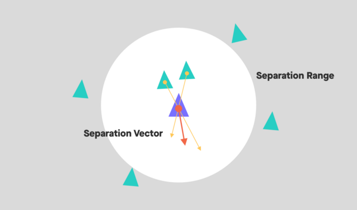
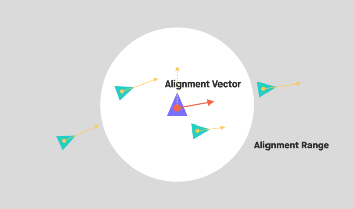

# Flocking agents behavior formal assignment

You are in charge of implementing some functions to make some AI agents flock together in a game. After finishing it, you will be one step further to render it in a game engine, and start making reactive NPCs and enemies. You will learn all the basic concepts needed to code and customize your own AI behaviors.

You can code this assignment in any language and/or game engine you want. But I already crafted some boilerplates to maximize your efficiency. 

- (Preferred) Formal and automatically tested: [This current repo](https://github.com/InfiniBrains/Awesome-GameDev-Resources/tree/main/docs/artificialintelligence/assignments/flocking) 
- (Funnier) Interactive with SDL2: [MoBaGEn](https://github.com/InfiniBrains/mobagen/tree/master/examples/flocking/behaviours)
- (Hard-core) C++ with CMake: [SDL2-CPM-CMake-Example](https://github.com/InfiniBrains/SDL2-CPM-CMake-Example)
- I don't recommend using Game Engines for this specific assignment. Historically, students fail on the implementation of the double buffering and the math operations. But if you are confident, go ahead.

!!! danger "Notes on imprecision"

    The automated tests of the formal assignment might differ somehow because of floating point imprecison, so don't worry much. If you cannot make it pass 100% of the tests, explain how you tried to solve it and what you think is wrong. I will evaluate your code based on your explanation. 
    If you find an issue on my formal description or on the tests, send a PR and I will give you extra points.

## What is flocking?

Flocking is a behavior that is observed in birds, fish and other animals that move in groups. It is a very simple behavior that can be implemented with a few lines of code. The idea is that each agent will try to move towards the center of mass of the group (cohesion), and will try to align its velocity with the average velocity of the group (AKA alignment). In addition, each agent will try to avoid collisions with other agents (AKA avoidance).

!!! note "Formal Notation Review"

    - \( \vec{F} \) means a vector \( F \) that has components. In a 2 dimensional vector it will hold \( F_x \) and \( F_y \). For example, if \( F_x = 1 \) and \( F_y = 3 \), then \( \vec{F} = (1,3) \)
    - Simple math operations between vectors are done component-wise. For example, if \( \vec{F} = (1,1) \) and \( \vec{G} = (2,2) \), then \( \vec{F} + \vec{G} = (3,3) \)
    - The notation \( \overrightarrow{P_{1}P_{2}} \) means the vector that goes from \( P_1 \) to \( P_2 \). It is the same as \( P_2-P_1 \)
    - The modulus notation means the length (magnitude) of the vector. \( |\vec{F}| = \sqrt{F_x^2+F_y^2} \) For example, if \( \vec{F} = (1,1) \), then \( |\vec{F}| = \sqrt{2} \)
    - The hat ^ notation means the normalized vector(magnitude is 1) of the vector. \( \hat{F} = \frac{\vec{F}}{|\vec{F}|} \) For example, if \( \vec{F} = (1,1) \), then \( \hat{F} = (\frac{1}{\sqrt{2}},\frac{1}{\sqrt{2}}) \)
    - The hat notation over 2 points means the normalized vector that goes from the first point to the second point. \( \widehat{P_1P_2} = \frac{\overrightarrow{P_1P_2}}{|\overrightarrow{P_1P_2}|} \) For example, if \( P_1 = (0,0) \) and \( P_2 = (1,1) \), then \( \widehat{P_1P_2} = (\frac{1}{\sqrt{2}},\frac{1}{\sqrt{2}}) \)
    - The sum \( \sum \) notation means the sum of all elements in the list going from `0` to `n-1`. Ex. \( \sum_{i=0}^{n-1} \vec{V_i} = \vec{V_0} + \vec{V_1} + \vec{V_2} + ... + \vec{V_{n-1}} \)

It is your job to implement those 3 behaviors following the ruleset below:

### Cohesion

Apply a force towards the center of mass of the group.

1. The \( n \) neighbors of an agent are all the other agents that are within a certain radius \( r_c \)( `<` operation ) of the agent. It doesn't include the agent itself;
2. Compute the location of the center of mass of the group (\( P_{CM} \));
3. Compute the force that will move the agent towards the center of mass(\( \overrightarrow{F_c} \)); The farther the agent is from the center of mass, the force increases linearly up to the limit of the cohesion radius \( r_c \).


\[ 
P_{CM} = \frac{\sum_{i=0}^{n-1} P_i}{n}
\]

\[
\overrightarrow{F_{c}} = \begin{cases}
    \frac{ \overrightarrow{P_{agent}P_{CM}} }{r_c} & \text{if } |\overrightarrow{P_{agent}P_{CM}}| \leq r_c \\
    0 & \text{if } |\overrightarrow{P_{agent}P_{CM}}| > r_c
\end{cases}
\]

!!! tip

    Note that the maximum magnitude of \( \overrightarrow{F_c} \) is 1. Inclusive. This value can be multiplied by a constant \( K_c \) to increase or decrease the cohesion force to looks more appealing.

??? example "Cohesion Example"

    

### Separation

It will move the agent away from other agents when they get too close.

1. The \( n \) neighbors of an agent are all the other agents that are within the separation radius \( r_s \) of the agent;
2. If the distance to a neighbor is less than the separation radius, then the agent will move away from it inversely proportionally to the distance between them.
3. Accumulate the forces that will move the agent away from each neighbor (\( \overrightarrow{F_{s}} \)). And then, clamp the force to a maximum value of \( F_{Smax} \).

   

\[
\overrightarrow{F_s} = \sum_{i=0}^{n-1} \begin{cases}
      \frac{\widehat{P_aP_i}}{|\overrightarrow{P_aP_i}|} & \text{if } 0 < |\overrightarrow{P_aP_i}| \leq r_s \\
      0 & \text{if } |\overrightarrow{P_aP_i}| = 0  \lor |\overrightarrow{P_aP_i}| > r_s 
\end{cases}
\]

!!! tip

    Here you can see that if we have more than one neighbor and one of them is way too close, the force will be very high and make the influence of the other neighbors irrelevant. This is the expected behavior.

The force will go near infinite when the distance between the agent and the \( n \) neighbor is 0. To avoid this, after accumulating all the influences from every neighbor, the force will be clamped to a maximum magnitude of \( F_{Smax} \).

\[
\overrightarrow{F_{s}} = \begin{cases} 
    \overrightarrow{F_s} & \text{if } |\overrightarrow{F_s}| \leq F_{Smax} \\
    \widehat{F_s} \cdot F_{Smax} & \text{if } |\overrightarrow{F_s}| > F_{Smax}
\end{cases}
\]

!!! tip

    - You can implement those two math together, but it is better to isolate in two steps to make it easier to understand and debug.
    - This is not an averaged force like the cohesion force, it is a sum of forces. So, the maximum magnitude of the force can be higher than 1.

??? example "Separation Example"

    

### Alignment

It is the force that will align the velocity of the agent with the average velocity of the group.

1. The \( n \) neighbors of an agent are all the agents that are within the alignment radius \( r_a \) of the agent, including itself;
2. Compute the average velocity of the group (\( \overrightarrow{V_{avg}} \));
3. Compute the force that will move the agent towards the average velocity (\( \overrightarrow{F_{a}} \));



\[
\overrightarrow{V_{avg}} = \frac{\sum_{i=0}^{n-1} \vec{V_i}}{n}
\]

??? example "Alignment Example"

    

## Behavior composition

The force composition is made by a weighted sum of the influences of those 3 behaviors. This is the way we are going to work, this is not the only way to do it, nor the more correct. It is just a way to do it. 

- \(  \vec{F} = K_c \cdot \overrightarrow{F_c} + K_s \cdot \overrightarrow{F_s} + K_a \cdot \overrightarrow{F_a}  \)  `This is a weighted sum!`
- \(  \overrightarrow{V_{new}} = \overrightarrow{V_{cur}} + \vec{F} \cdot \Delta t  \)  `This is a simplification!`
- \(  P_{new} = P_{cur}+\overrightarrow{V_{new}} \cdot \Delta t  \)  `This is an approximation!`

!!! warning

    A more precise way for representing the new position would be to use full equations of motion. But given timestep is usually very small and it even squared, it is acceptable to ignore it. But here they are anyway, just dont use them in this assignment:

    - \(  \overrightarrow{V_{new}} = \overrightarrow{V_{cur}}+\frac{\overrightarrow{F}}{m} \cdot \Delta t  \)
    - \(  P_{new} = P_{cur}+\overrightarrow{V_{cur}} \cdot \Delta t + \frac{\vec{F}}{m} \cdot \frac{\Delta t^2}{2}  \)

Where:

- \( \overrightarrow{F} \) is the force applied to the agent;
- \( \overrightarrow{V} \) is the velocity of the agent;
- \( P \) is the position of the agent;
- \( m \) is the mass of the agent, here it is always 1;
- \( \Delta t \) is the time frame (1/FPS);
- \( cur \) is the current value of the variable;
- \( new \) is the new value of the variable to be used in the next frame.

The \( \overrightarrow{V_{new}} \) and \( P_{new} \) are the ones that will be used in the next frame and you will have to print to the console at the end of every single frame.

!!! note

    - For simplicity, we are going to assume that the mass of all agents is 1.
    - In a real game simulation, it would be nice to apply some friction to the velocity of the agent to make it stop eventually or just clamp it to prevent the velocity get too high. But, for simplicity, we are going to ignore it.

??? example "Combined behavior examples"

    Alignment + Cohesion:

    

    Separation + Cohesion:

    

    Separation + Alignment:

    

    All 3:

    

## Input

The input consists in a list of parameters followed by a list of agents. The parameters are:

- \( r_c \) - Cohesion radius
- \( r_s \) - Separation radius
- \( F_{Smax} \) - Maximum separation force
- \( r_a \) - Alignment radius
- \( K_c \) - Cohesion constant
- \( K_s \) - Separation constant
- \( K_a \) - Alignment constant
- \( N \) - Number of agents

Every agent is represented by 4 values in the same line, separated by a space:

- \( x \) - X coordinate
- \( y \) - Y coordinate
- \( vx \) - X velocity
- \( vy \) - Y velocity

After reading the agent's data, the program should read the time frame (\( \Delta t \)), simulate the agents and then output the new position of the agents in the same sequence and format it was read. The program should keep reading the time frame and simulating the agents until the end of the input.

!!! note "Data Types"

    All values are double precision floating point numbers to improve consistency between different languages.

### Input Example

In this example we are going to test only the cohesion behavior. The input is composed by the parameters and 2 agents. 

```text
1.000 0.000 0.000 0.000 1.000 0.000 0.000 2
0.000 0.500 0.000 0.000
0.000 -0.500 0.000 0.000
0.125
```

## Output

The expected output is the position and velocity for each agent after the simulation step using the time frame. After printing each simulation step, the program should wait for the next time frame and then simulate the next step. All values should have exactly 3 decimal places and should be rounded to the nearest.

```text
0.000 0.484 0.000 -0.125
0.000 -0.484 0.000 0.125
```

## Grading 

10 points total:

- 3 Points – by following standards;
- 2 Points – properly submitted in Canvas;
- 5 Points – passed on test cases;
